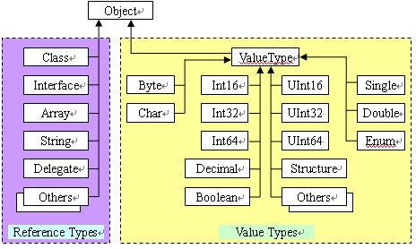

# 类型

### 1、主要类型

.net中所有类型继承于System.Object。主要分为两大类：引用类型（托管类型）和值类型。

### 2、区别：

* 值类型：存在栈中，FIFO， 所以值类型变量推出作用域之前会释放资源

* 引用类型：x = new Object(), Object分配在托管堆上，x存储在栈上，记录Object的地址。
* 栈从高地址向低地址分配内存，堆相反

### 3. 继承自System.Object的方法

1、公共方法

* Equals：两个对象具有相同的值
* GetHashCode：返回对象的值的哈希码（注：如果某个类型要在哈希表集合，如Dictionary中国作为键使用，应重写该方法）
* ToString：默认返回类型的完整名称，同this.GetType(),FullName。通常重写该方法，用于返回包含对象特定状态表示的string对象。
* GetType： 返回从Type派生的一个类型的实例，指出调用GetType的对象是什么类型。和反射类配合获取与对象类型有关的元数据信息。

2、受保护方法

* MemberwiseClone： 创建类型的新实例，将新对象的实例字段设置与this对象的实例完全一致
* Finalize： 垃圾回收器变短对象应作为垃圾被回收之后，在对象的内存被实际回收之前，调用这个虚方法，执行清理工作

### 4、对象的创建

1、计算类型及所有基类型（直到System.Object）中定义的所有实例字段需要的字节数。堆上每个对象都需要一些额外的成员，包括类型对象指针和同步块索引。

2、从托管堆中分配类型要求的字节数，从而分配对象的内存，分配的额所有字节设为零。

3、初始化对象的类型对象指针诶同步块索引成员。

4、调用类型的实例构造器，传递在new调用中指定的实参。

5、返回新建对象的一个引用。

### 5、类型转换

1、CLR最重要的特性之一是类型安全

2、CLR在运行知道对象的类型是什么，调用GetType方法可以直到对象的确切类型

3、GetType是非虚方法，一个类型不能通过重写GetType方法伪装成另一个类型

4、派生类可以隐式转换为基类，基类只能显示转换为派生类（如果没有派生关系，转换出错，抛出System.InvalidCastException异常